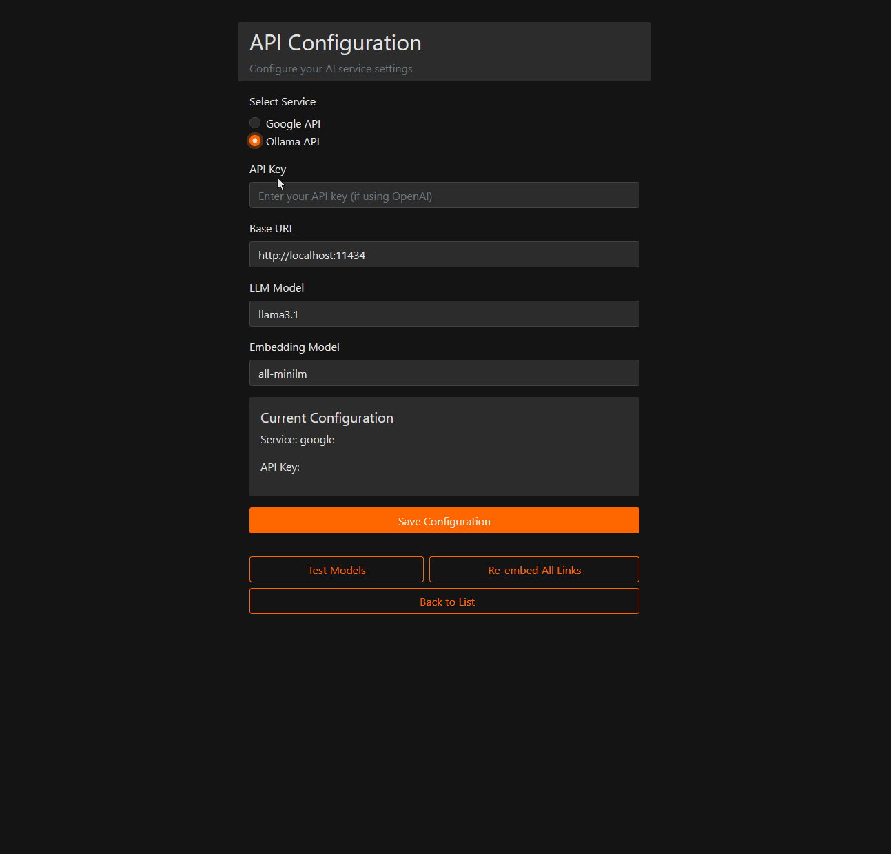

# 📖 Semantic Bookmark Manager

A web application for managing bookmarks with semantic search capabilities. Traditional bookmark managers can become disorganized and difficult to navigate as they grow. Unlike a categorical approach, this tool eliminates the need to organize bookmarks manually, simplifying the user experience.

It is a simple Flask app with minimal CSS and JavaScript, quick to set up and easy to use. Features focus only on quickly adding and retrieving bookmarks.

## 💻 Demo


## 🔥 Features
- Adding one or multiple bookmarks
- Auto scraping content from the URL and generating summaries
- Semantic search using the RAG technique
- API endpoints for integration with other tools
- Desktop and mobile layout
- Data stored in a CSV file
- Support models:
    - ♊ Google Gemini
        - Embedding model: `gemini-1.5-flash`
        - LLM model: `text-embedding-400`
    - 🦙 Ollama
        - Embedding model: `all-minilm`
        - LLM model: `llama3.1`
    
## Prerequisites
- One of the following:
  - [Ollama](https://ollama.com/)
  - [Google API credentials](https://ai.google.dev/)

## 💻 Setup

#### 🐳 Docker
1. Clone the repository
2. Run `docker compose up -d`
3. Access the web interface at `http://localhost:9696`

#### ⚒ Manual
1. Clone the repository
2. Install dependencies:
   ```
   pip install -r requirements.txt
   ```
3. Set up your configuration:
   - For local Ollama setup:
     - Ensure [Ollama](https://ollama.com/) is installed and running on your machine
     - Configure Ollama to accept external connections (if the app and Ollama are running on different machines):
       ```
       export OLLAMA_HOST=0.0.0.0
       ```
   - For Google Gemini setup:
     - Obtain [Google API credentials](https://ai.google.dev/) and set them up in the configuration

    - Start the Flask application:
        ```
        python app.py
        ```
    - Access the web interface at `http://localhost:5000`
    - Use the configuration page to set up your preferred AI service (Ollama or Google Gemini)

## 🔗 API Integration

The application provides API endpoints for integration with other tools. Details are below:
- **POST** `/api/search`
```
Request format:
{
    "query": "search query string",
    "page": 1,  // optional, default is 1
    "per_page": 10  // optional, default is 10
}

Returns:
{
    "results": [
        {
            "link": "bookmark url",
            "summary": "bookmark summary",
            "base_url": "base url of the bookmark",
            "timestamp": "bookmark creation timestamp",
            "similarity": float  // similarity score
        },
        ...
    ],
    "total_results": int,
    "page": int,
    "per_page": int,
    "total_pages": int
}
```
- **POST** `/api/add`
```
Request format:
{
    "url": "https://example.com"
}

Returns:
- 201: Bookmark added successfully
- 400: Missing url parameter or bookmark already exists
- 500: Internal server error
```

## 📝 Notes

- At least two AI models are required: one for embedding and one for language processing (LLM)
- Google Gemini is recommended as it is cloud-based and the Free Tier is more than enough to run this app (until they change the pricing 😟)
- Ollama support is available, but you need to run it on the server side for mobile devices to work (until Ollama has support for mobile devices 👍)
- When switching between models, you need to reembed all the urls. This is due to the different numpy array shape between **text-embedding-004** and **all-minilm**.

## 🤝 Contributing

Contributions are welcome! Please feel free to submit a Pull Request.

## 📜 License

This project is open-source and available under the MIT License.